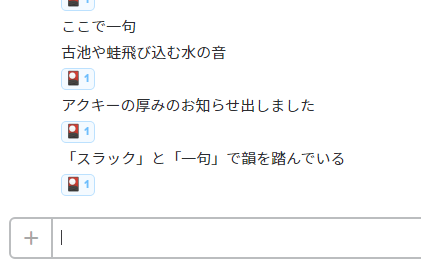

slack-ikku [![Build Status][travis-image]][travis-url] [![Dependency Status][david-image]][david-url] [![devDependency Status][david-dev-image]][david-dev-url]
==========

[](https://greenkeeper.io/)

[travis-image]: https://travis-ci.org/hakatashi/slack-ikku.svg?branch=master
[travis-url]: https://travis-ci.org/hakatashi/slack-ikku
[david-image]: https://david-dm.org/hakatashi/slack-ikku.svg
[david-url]: https://david-dm.org/hakatashi/slack-ikku
[david-dev-image]: https://david-dm.org/hakatashi/slack-ikku/dev-status.svg
[david-dev-url]: https://david-dm.org/hakatashi/slack-ikku#info=devDependencies



slack-ikkuだよ。一句を見つけて自動でReactionをつけるすごいやつだよ。

[ブログ記事](http://inside.pixiv.net/entry/2016/07/05/194025)

## インストール

```sh
git clone https://github.com/hakatashi/slack-ikku.git
cd slack-ikku
npm install
cp config.example.json.ls config.json.ls
vi config.json.ls
```

## 起動

```sh
npm start
```
